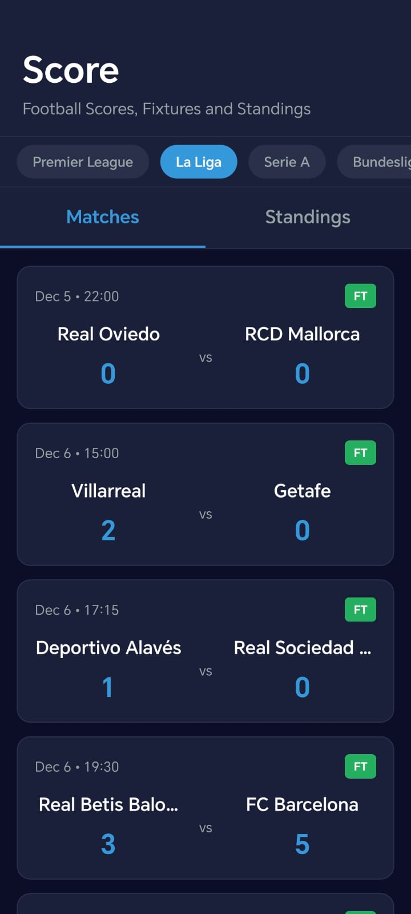
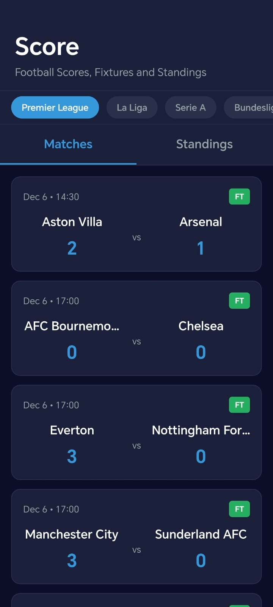
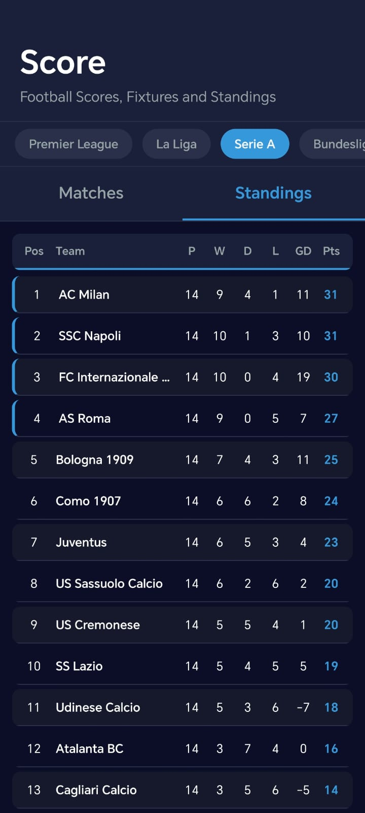

# Score - Football Scores, Fixtures and Standings

A modern React Native mobile application built with Expo that provides real-time football scores, fixtures, and league standings for the top 5 European football leagues.

## 📱 Features

- **Live Scores**: View real-time match scores and status (LIVE, FINISHED, SCHEDULED)
- **League Standings**: Complete league tables with position, points, wins, draws, losses, and goal difference
- **5 Major Leagues**: 
  - Premier League (England)
  - La Liga (Spain)
  - Serie A (Italy)
  - Bundesliga (Germany)
  - Ligue 1 (France)
- **Match Details**: View match dates, times, and scores
- **Clean UI**: Dark theme with intuitive navigation
- **Real-time Data**: Fetches live data from Football-Data.org API

## 🚀 Getting Started

### Prerequisites

- Node.js (v14 or higher)
- npm or yarn
- Expo CLI (`npm install -g expo-cli`)
- Expo Go app on your mobile device (for testing)

### Installation

1. Clone or download the project
2. Navigate to the project directory:
   ```bash
   cd flashscore
   ```

3. Install dependencies:
   ```bash
   npm install
   ```

4. Start the Expo development server:
   ```bash
   npm start
   ```

5. Scan the QR code with Expo Go app (iOS) or Camera app (Android)

## 📦 Project Structure

```
flashscore/
├── App.js              # Main application component
├── package.json        # Dependencies and scripts
├── app.json           # Expo configuration
└── README.md          # This file
```

## 🔧 Configuration

### API Setup

The app uses the Football-Data.org API to fetch real-time football data. You need to:

1. Sign up for a free account at [Football-Data.org](https://www.football-data.org/)
2. Get your API token from your account dashboard
3. Add your token to `App.js`:

```javascript
const API_TOKEN = 'API_TOKEN';
```

**Note**: The free tier of Football-Data.org API has rate limits (approximately 10 requests per minute).

### App Configuration

The app configuration is defined in `app.json`:

- **Name**: Score
- **Platform**: Android & iOS
- **Orientation**: Portrait
- **Theme**: Dark

## 🎨 Features Overview

### League Selection
- Horizontal scrollable league selector
- Tap to switch between different leagues
- Visual indicator for selected league

### Matches Tab
- Displays upcoming, live, and finished matches
- Shows match date and time
- Displays team names (with "FC" suffix removed for cleaner display)
- Match status indicators:
  - **LIVE**: Red badge for ongoing matches
  - **FT**: Green badge for finished matches
  - **Time**: Grey badge showing scheduled match time

### Standings Tab
- Complete league table with:
  - Position (Pos)
  - Team name
  - Played games (P)
  - Wins (W)
  - Draws (D)
  - Losses (L)
  - Goal difference (GD)
  - Points (Pts)
- Top 4 teams highlighted with blue border
- Alternating row colors for better readability

## 🛠️ Technologies Used

- **React Native**: Cross-platform mobile development framework
- **Expo**: Development platform and toolchain
- **JavaScript**: Programming language
- **Football-Data.org API**: Real-time football data provider

## 📱 Supported Platforms

- ✅ Android
- ✅ iOS
- ✅ Web (via Expo)

## 🔄 Data Refresh

The app automatically fetches fresh data when:
- A different league is selected
- The app is pulled down to refresh (pull-to-refresh gesture)

## 🎯 Key Functions

### Data Fetching
- `fetchMatches()`: Retrieves match data for the selected league
- `fetchStandings()`: Retrieves league standings/table data

### Data Processing
- `cleanTeamName()`: Removes "FC" and "CF" suffixes from team names
- `formatDate()`: Formats match dates for display
- `formatTime()`: Formats match times for display

### UI Components
- League selector with horizontal scrolling
- Tab navigation (Matches/Standings)
- Match cards with team information
- Standings table with sortable columns

## 💻 Essential Code Snippets

### API Data Fetching

```javascript
const fetchMatches = async () => {
  const API_TOKEN = 'YOUR_API_TOKEN_HERE';
  const leagueCode = selectedLeague.code;
  
  const competitionUrl = `https://api.football-data.org/v4/competitions/${leagueCode}/matches?dateFrom=${dateFromStr}&dateTo=${dateToStr}&status=SCHEDULED,LIVE,FINISHED&limit=30`;
  
  const response = await fetch(competitionUrl, {
    headers: {
      'X-Auth-Token': API_TOKEN,
    },
  });
  
  if (response.ok) {
    const data = await response.json();
    if (data.matches && data.matches.length > 0) {
      setMatches(data.matches);
      setUsingMockData(false);
    }
  }
};
```

### State Management

```javascript
const [selectedLeague, setSelectedLeague] = useState(LEAGUES[0]);
const [matches, setMatches] = useState([]);
const [standings, setStandings] = useState([]);
const [loading, setLoading] = useState(true);
const [activeTab, setActiveTab] = useState('matches');

useEffect(() => {
  fetchData();
}, [selectedLeague]);
```

### Team Name Cleaning Function

```javascript
const cleanTeamName = (name) => {
  if (!name) return name;
  return name
    .replace(/\s+FC\s*$/i, '')  // Remove " FC" at the end
    .replace(/\s+FC\s+/i, ' ')   // Remove " FC " in the middle
    .replace(/\s+CF\s*$/i, '')   // Remove " CF" (Spanish)
    .replace(/\s+CF\s+/i, ' ')   // Remove " CF " in the middle
    .trim();
};
```

### Match Status Display

```javascript
const getStatusColor = (status) => {
  if (status === 'LIVE') return '#e74c3c';
  if (status === 'FINISHED') return '#27ae60';
  return '#95a5a6';
};

const getStatusText = (status) => {
  if (status === 'LIVE') return 'LIVE';
  if (status === 'FINISHED') return 'FT';
  return formatTime(new Date().toISOString());
};
```

### League Selector Component

```javascript
<ScrollView 
  horizontal 
  showsHorizontalScrollIndicator={false}
  style={styles.leagueSelector}
>
  {LEAGUES.map((league) => (
    <TouchableOpacity
      key={league.id}
      style={[
        styles.leagueButton,
        selectedLeague.id === league.id && styles.leagueButtonActive,
      ]}
      onPress={() => setSelectedLeague(league)}
    >
      <Text style={styles.leagueButtonText}>
        {league.name}
      </Text>
    </TouchableOpacity>
  ))}
</ScrollView>
```

## 📊 API Endpoints Used

The app uses the following Football-Data.org API endpoints:

1. **Matches**: 
   - `GET /v4/competitions/{competition}/matches`
   - Filters: `dateFrom`, `dateTo`, `status`, `limit`

2. **Standings**: 
   - `GET /v4/competitions/{competition}/standings`

### League Codes
- `PL`: Premier League
- `PD`: La Liga
- `SA`: Serie A
- `BL1`: Bundesliga
- `FL1`: Ligue 1

## 🎨 Styling

The app features a modern dark theme with:
- Dark blue background (`#0a0e27`)
- Accent color: Blue (`#3498db`)
- Status colors:
  - Red for LIVE matches
  - Green for FINISHED matches
  - Grey for scheduled matches

## 📝 Dependencies

Key dependencies listed in `package.json`:
- `react`: ^18.2.0
- `react-native`: 0.72.6
- `expo`: ~49.0.15

## 🐛 Troubleshooting

### API Rate Limiting
If you encounter rate limit errors:
- Wait a minute before making more requests
- The app will automatically fall back to cached data if available

## 📄 License

This project is for educational purposes. The Football-Data.org API is free to use but has rate limits.
This project is made by Mustafa Acar.

## 👤 Author

Created as a React Native mobile application project.

## 🔗 Resources

- [Expo Documentation](https://docs.expo.dev/)
- [React Native Documentation](https://reactnative.dev/)
- [Football-Data.org API](https://www.football-data.org/)

## 📱 Screenshots

The app features:
- Clean, modern dark theme interface
- Easy league navigation
- Real-time match scores
- Comprehensive league standings
- Intuitive tab-based navigation

### App Screenshots








 

## 💭 Reflections

### What I Learned
- React Native development with Expo framework
- API integration and data fetching in mobile apps
- State management with React hooks (useState, useEffect)
- Responsive UI design for mobile devices
- Working with external APIs and handling rate limits

### Challenges
- Implementing real-time data fetching from external APIs
- Handling API rate limits and error states
- Creating a responsive and user-friendly UI layout
- Managing state across multiple components
- Optimizing data display for different screen sizes

### Future Improvements
- Add match details page with more statistics
- Implement push notifications for live matches
- Add favorite teams functionality
- Include match history and head-to-head statistics
- Add more leagues and competitions
- Implement caching for offline functionality

---

**Made by**: Mustafa Acar - mustafa.acar@tuni.fi
**Website**: https://portfolio.mnacar.com
**LinkedIn**: https://www.linkedin.com/in/mustafa-acar-5961002a2/
**GitHub**: https://github.com/macar3420/flashscore

